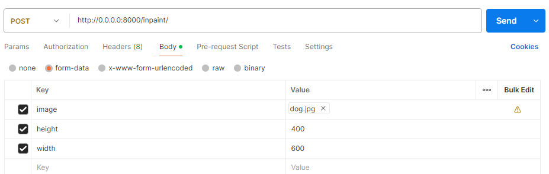

# Image Inpainting API - Setup and Run Guide
This document provides step-by-step instructions to install and run the Image Inpainting API locally with or without GPU support.

This guide provides instructions on how to run the Image Inpainting API in two different scenarios:
- **Running without Docker**
- **Running with Docker**
    - With NVIDIA GPU Supported.
    - Without NVIDIA GPU(CPU).


# Prerequisites
 - **General Requirements:**
    - Python 3.10 or higher
    - Docker Desktop
    - If you have a NVIDIA GPU, install NVIDIA [drivers](https://www.nvidia.com/en-us/drivers/) based on you gpu configurations.
    - If you have a NVIDIA GPU, install [NVIDIA CUDA Toolkit](https://developer.nvidia.com/cuda-toolkit) and [cuDNN](https://developer.nvidia.com/cudnn)
 - **Configure Environment Variables:**
    - Create a .env file inside root directory after cloning the repository.
    - PROMPT, NEGATIVE_PROMPT, GUIDANCE_SCALE, STRENGTH and NUM_INFERENCE_STEPS are optional (preconfigured). Only adjust if needed. MODEL_NAME is required
    ```
    #PROMPT=PROMPT  #Not Required
    #NEGATIVE_PROMPT=NEGATIVE_PROMPT #Not Required
    #GUIDANCE_SCALE=7 #Not Required
    #STRENGTH=0.1 #Not Required
    MODEL_NAME=runwayml/stable-diffusion-inpainting #Required
    #NUM_INFERENCE_STEPS=NUM_INFERENCE_STEPS #Not Required
   ```
# Clone the Repository:
   ```
   git clone https://github.com/fusionsami/ImageInpaintingAPI.git
   cd ImageInpaintingAPI
   ```
# Project Structure:
   ```
│   .env
│   .gitignore
|   docker-compose-cpu.yml
│   docker-compose-gpu.yml
│   Dockerfile
│   Installation.md
│   README.md
│   requirements.txt
│
├───app
│   │   logging_config.py
│   │   main.py
│   │   models.py
│   │   utils.py
│           
├───example_images
│       dog.jpg
│       dog_inpainted.jpg
│       postman_api_details.png
│
└───logs
        error.log
        info.log
        warning.log
   ```

# Running without Docker

### Step 1: Set Up Python Virtual Environment
 - Create a Python virtual environment and activate.
   ```
   python -m venv venv
   venv\Scripts\activate
   ```
### Step 2: Install Dependencies
 - Install requirements.txt and torch with cuda support.
   ```
   pip install -r requirements.txt
   pip install torch torchvision torchaudio --index-url https://download.pytorch.org/whl/cu121
   ```
### Step 3: Run the Application
 - Once everything is set up, run the FastAPI app using Uvicorn.
   ```
   uvicorn app.main:app --host 0.0.0.0 --port 8000 --reload
   ```
   
# Running with Docker (GPU Supported)
### Run the Application
 - In root directory buid and up using docker-compose-gpu.yml file.
 - Make sure you have NVIDIA GPU in your system.
   ```
   docker-compose -f docker-compose-gpu.yml up
   ```
- Useful Docker Commands:
  ```
   docker-compose -f docker-compose-gpu.yml build #rebuild the Docker image
   docker-compose -f docker-compose-gpu.yml start #To start the services defined in your docker-compose.yml file
   docker-compose -f docker-compose-gpu.yml down #To stop the running services
   docker-compose -f docker-compose-gpu.yml logs app-gpu #To view logs of a specific service
   docker-compose -f docker-compose-gpu.yml exec app-gpu /bin/sh #To run a command in the running container
   
  ```

# Running with Docker (Without GPU)
### Run the Application
 - In root directory buid and up using docker-compose-cpu.yml up file.
 - If your system dont have a NVIDIA GPU, use this method.
   ```
   docker-compose -f docker-compose-cpu.yml up
   ```
- Useful Docker Commands:
  ```
   docker-compose -f docker-compose-cpu.yml build #rebuild the Docker image
   docker-compose -f docker-compose-cpu.yml start #To start the services defined in your docker-compose.yml file
   docker-compose -f docker-compose-cpu.yml down #To stop the running services
   docker-compose -f docker-compose-cpu.yml logs app-cpu #To view logs of a specific service
   docker-compose -f docker-compose-cpu.yml exec app-cpu /bin/sh #To run a command in the running container
   
  ```

 # Logs
  - Logs for all methods will be stored in the same location (./logs) as per the project structure.
  - Console log is also included for easy debugging.


# .env Parameters Details

### MODEL_NAME
- **Description**: Specifies the pre-trained model to use.
- **Example**: `runwayml/stable-diffusion-inpainting`
- **Required**: Yes
- **Purpose**: Uses a pre-trained model that applies generative techniques to fill in missing parts of an image.

### GUIDANCE_SCALE (optional)
- **Description**: Controls the "creativity" or adherence to the prompt during generation.
- **Typical Range**: 7 to 10
- **Purpose**: A lower scale allows more variation, while a higher scale makes the output closely match the prompt.

### STRENGTH (optional)
- **Description**: Determines the extent to which the inpainting affects the original image.
- **Typical Range**: 0.0 to 1.0
- **Purpose**: A value closer to 1.0 changes the image more drastically, while lower values preserve more of the original content.

### NUM_INFERENCE_STEPS (optional)
- **Description**: Specifies the number of diffusion steps during generation.
- **Purpose**: Higher values yield more refined and potentially higher-quality images, but also increase computation time.

By tuning these parameters, you can control the balance between preserving the original image and applying new content based on the prompt in the inpainting process.


# Testing the API
  - You can now test the API locally. Go to http://localhost:8000/inpaint/ using POST method.
  - Please check the given curl:
    ```
     curl --location 'http://0.0.0.0:8000/inpaint/' \
     --form 'image=@"/E:/ImageInpainting/dg.jpg"' \
     --form 'height="400"' \
     --form 'width="600"'
    ```

  ### Example:
   
     
